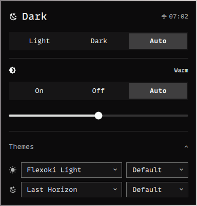

# Auto Theme

Light at sunrise. Dark at sunset. Your choice in between.

A native **Omarchy Quattro** bar plugin for light/dark themes, backgrounds, and
independent night light scheduling.



- **Light / Dark / Auto** — switch manually or follow the sun.
- **Night light** — On / Off / Auto, with a saved warmth setting from 2500–5500K.
- **Your pair** — choose a theme and background for each mode, side by side.
- **Native controls** — theme-aware colours, keyboard navigation, and reduced-motion support.

## Install

Requires Omarchy Quattro with its Quickshell-based shell. Classic Waybar-based
Omarchy is not supported.

Supports stable Omarchy 4.0.4 and newer Quattro shells with socket IPC.

```bash
yay -S sunwait
omarchy plugin add https://github.com/mwikala/omarchy-auto-theme.git --enable
```

Add **Auto Theme** to your bar through Omarchy's bar settings. Location is
found automatically; there is nothing to set up.

`sunwait` is an AUR dependency. Other runtime dependencies are Bash, GNU coreutils,
findutils, awk, grep, jq, curl, util-linux (`flock`), systemd user services, and
Omarchy's theme/shell commands. Night light uses Omarchy's `hyprsunset`.

```bash
omarchy plugin update mwikala.auto-theme
```

## Using the panel

The header shows the current mode and the next sunrise or sunset. Hover the
time to see which location it uses; click it to switch between **Automatic** and
**Manual**. Theme Auto and night light Auto are independent; either can keep
the scheduler running.

Drag the warmth slider right for warmer colours. The readout ranges from
**Subtle** to **Candlelight**; click or middle-click it to switch to Kelvin.
Release to save. When night light is inactive, the display returns to neutral
and uses the saved warmth at its next activation.

Middle-click or double-click the slider to reset to **Warm (4000K)**. With the
slider focused, Delete or Backspace does the same. Arrow keys adjust warmth.

Expand **Themes** to change either theme/background pair. **Default** lets Omarchy
choose the background; choosing a filename pins that image. Changing a theme
clears its old background pin. Hover a picker to read a truncated name.

Tab moves between controls; Enter/Space activates them; arrow keys adjust warmth
or navigate an open picker. Escape closes a picker first, then the panel.

Omarchy's own night-light toggle uses its stock 4000K. This plugin's controls and
schedule use your saved temperature.

## Location and privacy

Location is **automatic** by default: the plugin asks **https://ipinfo.io/json**
for the approximate location of your internet connection, then shows the nearest
town in the panel. The lookup is cached for 24 hours, failures are retried at
most hourly, and the last known location is kept while offline. It works the
same on Ethernet and Wi-Fi.

A VPN or some mobile networks can put that estimate somewhere else. Choose
**Manual** and search for your town or city instead; suggestions come from the
[Open-Meteo geocoding API](https://open-meteo.com/en/docs/geocoding-api)
(location data from [GeoNames](https://www.geonames.org)), which receives only
what you type. Pasting coordinates (`51.51, -0.13`) also works. Once saved, a
manual location is never sent anywhere. Switch back to **Automatic** at any time.

City search uses Open-Meteo's free non-commercial API, subject to its
[terms and rate limits](https://open-meteo.com/en/terms). The provider also sees
your connection's IP address. Search requests are debounced; no API key is
needed for personal use.

The plugin stores configuration in `~/.config/omarchy/auto-theme/config` and
runtime state, including cached coordinates, under
`${XDG_STATE_HOME:-~/.local/state}/omarchy/auto-theme/`.
The config resembles shell assignments but is read as data, never executed.

## Scheduling

Automation creates user-level systemd timers: an hourly recovery check and a
one-shot timer for the next sunrise or sunset. Boundaries run one minute after
the reported sun time to avoid rounding disagreements. Polar days/nights keep
the current solar phase and retry when another boundary becomes available.

The hourly check catches a missed transition after sleep. Manual theme changes
made outside the plugin are preserved until the next solar phase change.

## Application themes

Theme changes use Omarchy's built-in theme support, including supported apps
such as Zed. The plugin does not generate custom Zed palettes or edit its
settings. Existing personal Zed theme files are retained when upgrading.

## CLI

The engine lives inside the plugin; it need not be on `PATH`.

```bash
engine=~/.config/omarchy/plugins/mwikala.auto-theme/bin/omarchy-auto-theme

"$engine" status
"$engine" mode light
"$engine" enable
"$engine" disable
"$engine" nightlight auto
"$engine" temperature 3600
"$engine" temperature-display kelvin
"$engine" location auto
"$engine" location "51.5074 -0.1278" London
"$engine" location off
"$engine" config light "Flexoki Light"
"$engine" config dark-bg "1-dark-waters.jpg"
"$engine" backgrounds dark
```

## Remove

**Clean up the scheduler before removing the plugin directory:**

```bash
~/.config/omarchy/plugins/mwikala.auto-theme/bin/omarchy-auto-theme uninstall
omarchy plugin remove mwikala.auto-theme
```

Uninstall stops automation and removes its user-service links. Your selected
desktop theme remains in place. Configuration is retained for a later install.
Use `uninstall --purge` instead to also remove plugin configuration and runtime
state. Existing personal Zed themes and settings are retained.

Hiding or disabling a bar widget is not an uninstall. Run the engine's
`uninstall` command first if you want to stop all automation.

## Development checks

```bash
tests/run
tests/ui-run
omarchy plugin validate .
```

Backend tests isolate state and mock external commands and network requests.
UI checks run offscreen through Quickshell without changing your desktop.
The UI check also loads the widget's IPC handler. Test another shell with
`OMARCHY_PATH=/path/to/omarchy tests/ui-run`.

## License

MIT — [Mwikala Kangwa](LICENSE).
